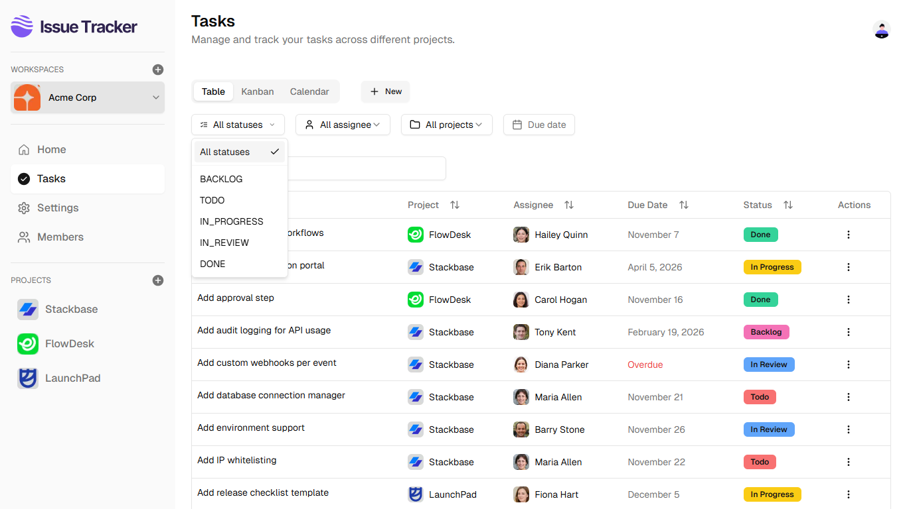
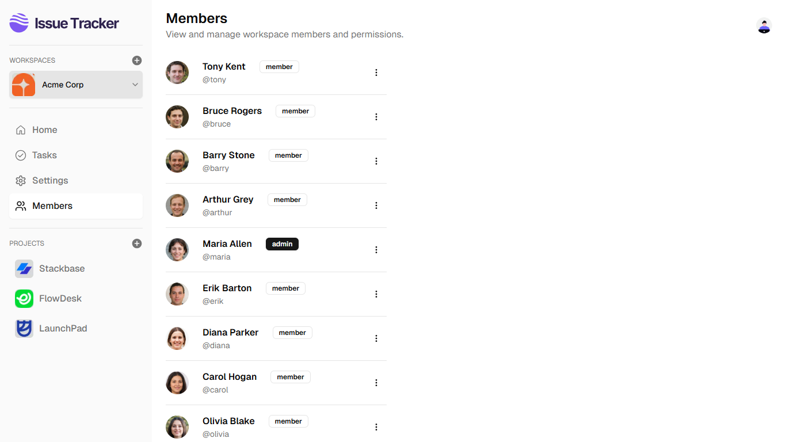
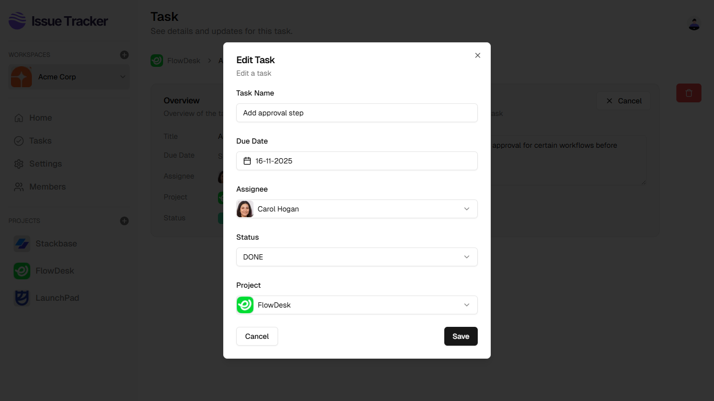

# Issue Tracker — Jira Clone (Next.js 15, MongoDB)

A full-stack **issue tracking and project management** application inspired by Jira.  
Built with **Next.js 15, React, MongoDB, React Query, Clerk, Cloudinary, Shadcn UI**, and **TypeScript**.

This app allows teams to collaborate seamlessly using **Workspaces, Projects, Tasks, Role-based Access**, and **multiple task views** like Kanban, Table, and Calendar.  
It demonstrates real-world SaaS functionality built from scratch with modern web technologies.

## 🚀 Live Demo

🌐 **Live URL:** [https://issue-tracker-react-nextjs.vercel.app](https://issue-tracker-react-nextjs.vercel.app)  
💻 **GitHub Repo:** [https://github.com/lnirjar/issue-tracker-nextjs](https://github.com/lnirjar/issue-tracker-nextjs)

### Demo User

```
Username: demo
Password: a#b#c#123
```

## 🛠️ Tech Stack

**Frontend & Framework**

- Next.js 15
- React 19
- Server Components + Client Components
- React Query
- React Hook Form
- Tailwind CSS
- Shadcn UI
- TypeScript

**Backend & Database**

- MongoDB
- Mongoose
- Zod

**Authentication & Storage**

- Clerk
- Cloudinary

**Utilities**

- Axios
- date-fns
- React Big Calendar
- React Icons
- Lucide Icons

## ✨ Features

### 🧩 Workspaces & Projects

- Create and manage multiple workspaces
- Upload workspace avatars via Cloudinary
- Invite members using workspace invite links
- Manage multiple projects within a workspace

### 👥 Team Collaboration

- Role-based permissions (**Admin / Member**)
- Assign tasks to workspace members
- Manage user roles within each workspace

### ✅ Task Management

- Create, update, and delete tasks
- Assign members, due dates, and statuses
- Task filtering and searching for quick access

### 🗂️ Task Views

- **Kanban Board** (drag-and-drop with `@hello-pangea/dnd`)
- **Table View** (powered by `@tanstack/react-table`)
- **Calendar View** (using `react-big-calendar`)

### 📊 Productivity Features

- Shimmer loading UI for smooth UX
- Optimistic updates & background refetching with React Query
- Analytics dashboard for workspace insights
- Fully responsive modern UI using Tailwind + Shadcn

### ⚙️ Architecture & Quality

- Server Components for faster initial load
- React Query for data fetching & caching
- Zod + TypeScript for runtime + compile-time validation
- Clean and modular file structure for scalability

## 📁 Folder Structure (Simplified)

```bash
src/
 ├─ app/
 ├─ components/
 ├─ hooks/
 ├─ lib/
 ├─ models/
 └─ schemas/
```

## 🔧 Environment Variables

Create a `.env.local` file in the root directory and add the following:

```
NEXT_PUBLIC_CLERK_PUBLISHABLE_KEY=
CLERK_SECRET_KEY=
NEXT_PUBLIC_CLERK_SIGN_IN_URL=/sign-in
NEXT_PUBLIC_CLERK_SIGN_UP_URL=/sign-up
SIGNING_SECRET=

MONGO_URI=

CLOUDINARY_CLOUD_NAME=
CLOUDINARY_API_KEY=
CLOUDINARY_API_SECRET=
```

## 💻 Installation & Setup

```sh
# 1️⃣ Clone the repository
git clone https://github.com/lnirjar/issue-tracker-nextjs.git

cd issue-tracker-nextjs

# 2️⃣ Install dependencies
npm install

# 3️⃣ Add your environment variables
# (see .env.local example above)

# 4️⃣ Run the development server
npm run dev
```

## 📦 Build

To create an optimized production build:

```sh
npm run build
npm start
```

## 🚀 Deployment

This project is deployed on Vercel.

## 🖼️ Screenshots

### Dashboard


### Workspace Switcher


### Tasks - Table View


### Tasks - Kanban View


### Tasks - Calendar View


### Task Details


### Project


### Filter Tasks



### Workspace Members



### Workspace Settings


### Create Workspace Form


### Create Project Form


### Create Task Form


### Edit Task Form


